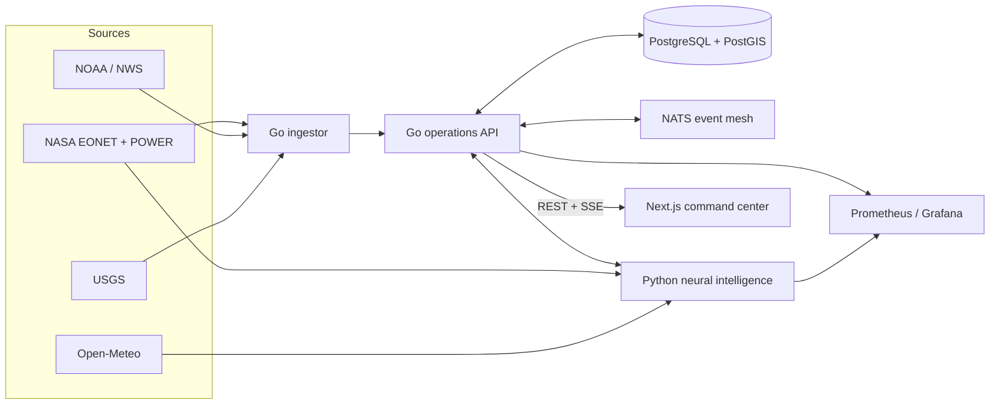

# CrisisMesh

Real-time disaster intelligence and response coordination. CrisisMesh turns NASA EONET, NASA POWER meteorology, NOAA/NWS alerts, Open-Meteo forecasts, and USGS earthquake feeds into a shared incident picture, assigns transparent operational risk, and recommends deployable response assets.

> CrisisMesh is a decision-support portfolio project. It is not an official warning service, evacuation authority, or replacement for local emergency management guidance.

## What makes it substantial

- Three-language system: Go for concurrent ingestion and APIs, Python for explainable scoring and optimization, TypeScript/Next.js for the command interface.
- Live external integrations with normalization, deduplication, timeouts, and source-aware fallbacks.
- PostGIS spatial persistence, NATS event distribution, Server-Sent Events, and a capacity-aware allocation engine.
- Reproducible 18-input neural risk model with provider caching, local feature-ablation explanations, a FastAPI runtime, and an explicit model card.
- Reproducible local deployment through Docker Compose and production-oriented Kubernetes packaging through Helm.
- CI, CodeQL, Trivy, SBOM/provenance-enabled releases, atomic deployments, HPA, disruption budgets, and default-deny network policy.
- Prometheus metrics, Grafana dashboard, health probes, structured logs, and a k6 load profile.

## Architecture



Read [the architecture deep dive](docs/architecture.md) for service boundaries and scaling decisions.

## Run locally

Requirements: Docker with Compose v2.

```bash
cp .env.example .env
docker compose up --build
```

Open:

- Command center: `http://localhost:3000`
- Operations API: `http://localhost:8080/api/v1/incidents`
- Prometheus: `http://localhost:9090`
- Grafana: `http://localhost:3001` (`admin` / `crisismesh`)
- NATS monitoring: `http://localhost:8222`

The web app automatically uses an embedded response scenario when the API is unavailable. This is deliberate: the portfolio demo still works on static preview infrastructure, while the header clearly labels it `SCENARIO MODE`.

## Test without containers

```bash
cd services/api && go test ./...
cd ../ingestor && go test ./...
cd ../intelligence && python -m unittest discover -s tests -v
cd ../.. && corepack enable && pnpm install && pnpm --filter @crisismesh/web typecheck && pnpm --filter @crisismesh/web build
```

## API highlights

| Method | Path | Purpose |
|---|---|---|
| `GET` | `/api/v1/incidents` | Filtered priority-ordered incident feed |
| `POST` | `/api/v1/incidents` | Normalized incident ingestion |
| `GET` | `/api/v1/stream` | Live SSE updates backed by NATS |
| `GET` | `/api/v1/resources` | Deployable resource inventory |
| `POST` | `/api/v1/allocations` | Generate a ranked response package |
| `GET` | `/api/v1/summary` | Operational rollup and source health |
| `GET` | `/metrics` | Prometheus metrics |

The full contract is in [OpenAPI](docs/openapi.yaml).

## Production deployment

Supply managed PostgreSQL/PostGIS and NATS endpoints, then install the chart:

```bash
helm upgrade --install crisismesh deploy/helm/crisismesh \
  --namespace crisismesh --create-namespace \
  --set-string secrets.databaseUrl="$DATABASE_URL" \
  --set-string secrets.apiKey="$CRISISMESH_API_KEY"
```

See the [operations runbook](docs/runbook.md), [threat model](docs/threat-model.md), and [delivery roadmap](docs/commit-roadmap.md).

The experimental neural system is documented in the [model card](docs/model-card.md), including its synthetic training disclosure and validation requirements.

## Measurable portfolio targets

- Under 300 ms read-path p95 at 25 concurrent virtual users.
- Under 15 seconds from accepted source event to connected operator display.
- Allocation explanations for every suggested asset; no autonomous dispatch.
- Successful rolling deployment with zero unavailable API pods.
- Recovery from a killed API pod without losing persisted incidents.

## License

MIT
