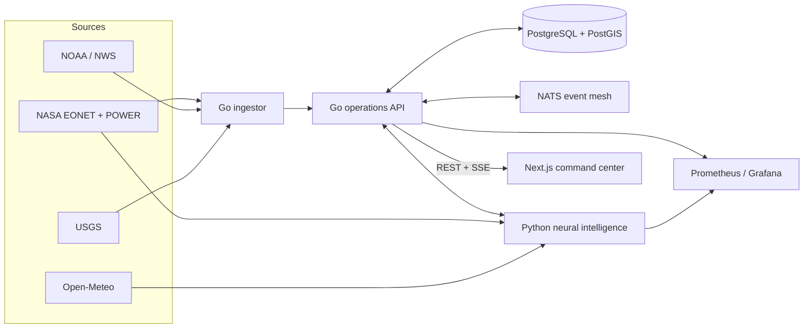

# CrisisMesh

Real-time disaster intelligence, demand prediction, and response coordination. CrisisMesh combines active disasters, weather warnings, infrastructure status, shelters, volunteers, and supplies in a shared operating picture. It estimates what responders may need in the next six hours, exposes inventory shortfalls, recommends where resources should stage, and reranks the plan whenever conditions or availability change.

> CrisisMesh is a decision-support portfolio project. It is not an official warning service, evacuation authority, or replacement for local emergency management guidance.

## What makes it substantial

- Three-language system: Go for concurrent ingestion and APIs, Python for explainable scoring and optimization, TypeScript/Next.js for the command interface.
- Live external integrations with normalization, deduplication, timeouts, and source-aware fallbacks.
- PostGIS spatial persistence, NATS event distribution, Server-Sent Events, and a capacity-aware allocation engine.
- Reproducible 21-input, six-output neural demand model trained on 18,500 NOAA and USGS records, with quantity ranges, feature-ablation explanations, chronological evaluation, and an explicit model card.
- Unit-aware gap analysis across shelter beds, medical teams, rescue teams, potable water, prepared meals, and evacuation seats.
- Interactive global operations workspace with worldwide incident selection, click-anywhere coordinate targets, great-circle staging distance, capacity tracking, infrastructure provenance, and revision-aware replanning.
- Focused product navigation with source provenance, preparedness, safety disclosures, licensing, and project links collected in a compact trust footer.
- Reproducible full-stack development through Docker Compose and public web/intelligence deployment through Vercel Services.
- CI, CodeQL, Trivy, four-service container builds, and SBOM/provenance-enabled image releases.
- Prometheus metrics, Grafana dashboard, health probes, structured logs, and a k6 load profile.

## Architecture



Read [the architecture deep dive](docs/architecture.md) for service boundaries and scaling decisions.

## Run locally

Requirements: Docker with Compose v2.

```bash
cp .env.example .env
docker compose up --build
```

Open:

- Prediction workspace: `http://localhost:3000`
- Collaborative operations map: `http://localhost:3000/operations`
- Incidents, sources, preparedness, and model card: `/incidents`, `/sources`, `/resources`, `/model`
- Operations API: `http://localhost:8080/api/v1/incidents`
- Prometheus: `http://localhost:9090`
- Grafana: `http://localhost:3001` (`admin` / `crisismesh`)
- NATS monitoring: `http://localhost:8222`

The web app automatically uses an embedded response scenario when the API is unavailable. This is deliberate: the portfolio demo still works on static preview infrastructure, while the header clearly labels it `SCENARIO MODE`.

## Test without containers

```bash
cd services/api && go test ./...
cd ../ingestor && go test ./...
cd ../intelligence && python -m unittest discover -s tests -v
cd ../.. && corepack enable && pnpm install && pnpm --filter @crisismesh/web typecheck && pnpm --filter @crisismesh/web build
```

## API highlights

| Method | Path | Purpose |
|---|---|---|
| `GET` | `/api/v1/incidents` | Filtered priority-ordered incident feed |
| `POST` | `/api/v1/incidents` | Normalized incident ingestion |
| `GET` | `/api/v1/stream` | Live SSE updates backed by NATS |
| `GET` | `/api/v1/resources` | Deployable resource inventory |
| `POST` | `/api/v1/allocations` | Generate a ranked response package |
| `GET` | `/api/v1/summary` | Operational rollup and source health |
| `GET` | `/metrics` | Prometheus metrics |
| `POST` | `/v3/demand` | Six-hour demand quantities, uncertainty ranges, and inventory gaps |
| `GET` | `/v3/model` | Demand-model architecture, proxy-label disclosure, and held-out metrics |
| `GET` | `/v2/providers/health` | Environmental-provider cache and timeout contracts |

The v2 multi-horizon endpoint remains available for backward compatibility, but the v3 demand
contract is the primary product surface.

The full contract is in [OpenAPI](docs/openapi.yaml).

## Deployment

The public portfolio application uses Vercel Services: Next.js serves the command center and
FastAPI serves the neural intelligence routes. The complete Go, Python, PostGIS, NATS, Prometheus,
and Grafana stack runs locally with Docker Compose. Tagged releases also publish the four service
images to GitHub Container Registry for straightforward self-hosting.

See the [operations runbook](docs/runbook.md), [threat model](docs/threat-model.md), and [delivery roadmap](docs/commit-roadmap.md).

The experimental neural system and official-source training snapshot are documented in the [training-data note](docs/training-data.md) and the in-app model card. Earlier scoring and multi-horizon endpoints remain available for compatibility but are no longer the primary prediction surface.
The public web and neural services deployment flow is documented in the [Vercel deployment guide](docs/deployment-vercel.md).

## Measurable portfolio targets

- Under 300 ms read-path p95 at 25 concurrent virtual users.
- Under 15 seconds from accepted source event to connected operator display.
- Allocation explanations for every suggested asset; no autonomous dispatch.
- Successful Vercel health and six-hour demand smoke tests after each production release.
- Recovery from a restarted API container without losing Postgres-backed incidents.

## License

MIT
